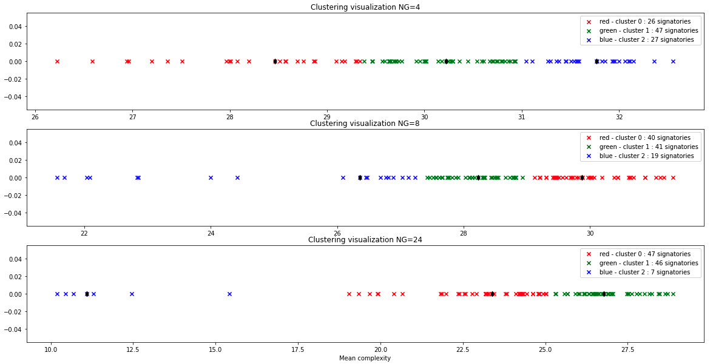
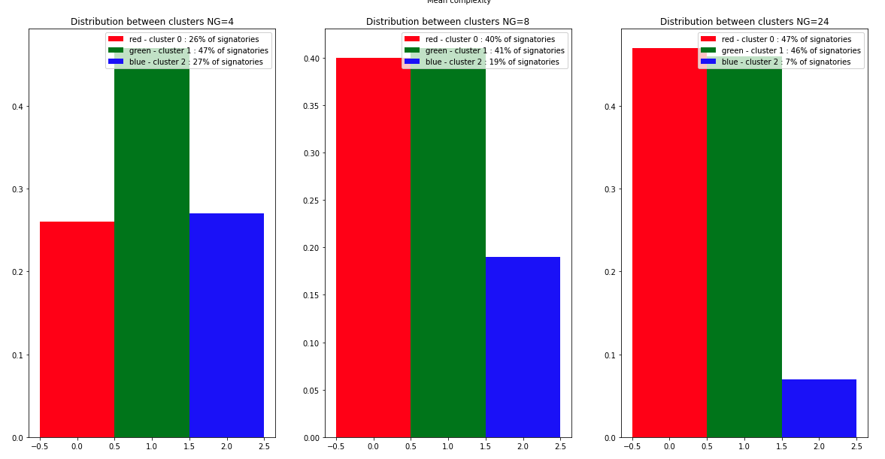

Classification non-supervisée de signature 
==========

# Tables des matières :

##1.    [Présentation des données](#data)  

##2.		[Classification non-supervisées des personnes pour analyser l’apport de la mesure de complexité](#p1) 
##3.		[Classification non-supervisées des signatures (writer-independent)](#p2)
##4.		[Apprentissage et généralisation](#p3)

-----------------

## 1. Présentation des données
### MCYT-100 :  
100 signataires - 25 signatures par signataire  

**Figure 1.a :** Les signatures du signataire n°17

On remarque d'ores et déjà des variabilité dans les signatures d'un même signataire, ce qui pourrait peut-être amener une variabilité dans la classification d'un même signataire.

### Complexités  :

Calculées par GMM avec un nombre de gaussiennes différent :  
NG = 4, 8 ou 24

**Figure 1.b :** Complexités moyennes des individus pour différentes valeurs de NG

## 2. Classification non-supervisées des personnes pour analyser l’apport de la mesure de complexité 

Pour chaque signataire nous calculons la complexité moyenne de ces signatures et ce pour les différentes valeures de NG. Nous obtenons ainsi pour chaque signataire 3 valeurs de complexités moyenne i.e pour NG = 2, 4, et 24. Nous représentons ces valeurs dans la figure çi-dessous :

**Figure 2.a :** Complexités moyennes des individus pour différentes valeurs de NG

###Nous pouvons faire deux observations :   
**Augmenter le nombre de gaussiennes NG :**    
1. Augmente la dispersion des complexités moyennes   
2. Diminue la moyenne des complexités moyennes 

En nous basant sur la complexité moyenne de chaque signataire nous allons classifier les signataires en 3 classes grâce aux méthodes de classification K-Moyennes et K-Means.

###1. K-Moyennes
**Pour NG=4**, on remarque que les 3 classes ne sont bien séparé, en effet la distance entre des individus "frontaliers" des différentes classes est très faible.

On en déduit donc que pour NG=4, il y'aurait très certainement des variabilités de classe d'une signature d'un même signataire si il a tendance a avoir une signature de complexité faible-moyen ou moyen-élévé.

On s'intéressera par ailleurs en 3. à la variabilité des signatures mais uniquement pour le cas NG = 24.

**Pour NG=8 et 24**, on observe déjà une meilleure classification notamment dans la séparation des signatures faibles et moyennements complexes.

Toutefois, on observe et on comprend ici le problème qui va nous suivre lors de tout ce projet, la classification des signatures à complexité moyennement haute. 

En effet, les signataires ayant une complexité de signature se situant sur la frontière moyen-haute vont très certainement générer de la variabilité et lorsqu'il faudra classifier les complexité de chaque signature et non pas la complexité moyenne de chaque signataire on observera très certainement une haute variabilité de classe chez les signataires à complexité moyen-élévé et une variabilité faible chez les signataires de complexité faible.

**Figure 2.1.a :** Visualisation de la classification pour différentes valeurs de NG

De plus, comme nous pouvons le voir ci-dessous, en augmentant NG on classifie d'autant moins de signataires en classe faible. Si on regarde la Figure 2.1.a on visualise cela par le passage de signataires de la classe faible à la classe moyen.

On se retrouve donc en NG=8 et 24 avec une forte distribution des signataires dans les classe à complexité moyennement et hautement élévée ce qui conforte notre remarque précédente.

**Figure 2.1.a :** Distribution des classes pour différentes valeurs de NG

Pour finir, avec la méthode de classification K-Means observons un échantillon de 5 signatures de chaque classes pour NG=24. La visualisation nous confirme ce que nous disait les données précedemment : si il est facile de distinguer la classe des signatures à complexité faible. Sans vérifier la complexité des signatures en légendes il nous est difficile de distinguer les classes moyenne et élévée.

**Figure 2.1.a :** Visualisation des signatures pour NG=24

###2. K-Medoids

**Pour NG=4**, cette classification est relativement similaire au K-means on retrouve 3 classes pas correctements séparées.

**Pour NG=8**, contrairement aux cas NG=8 du K-means, ici pour NG=8 on a encore un défaut de classification à la frontière de la classe de complexité faible et moyenne

**Pour NG=24**, on retrouve une classification similaire au K-Means, avec toujours le problème de classe de complexité moyenne et élevé trop proche.

Autant en K-means la classification est viable à partir de NG=8, ici en K-Medoids ce n'est seulement à NG=24 qu'on obtient une classification correcte.

**Figure 2.1.a :** Visualisation de la classification pour différentes valeurs de NG

La distribution confirme notre argument précédent, il a un changement significatif de distribution seulement pour NG=24, ce qui correspond principalement aux signataires classifiés comme moyen avec NG=4 et 8 puis classifié comme faible avec NG=24.

**Figure 2.1.a :** Distribution des classes pour différentes valeurs de NG

Même conclusion que pour K-means : on peut facilement distinguer la classe de complexité moyenne mais pas forcément celle de complexité moyenne ou élevée. 

**Figure 2.1.a :** Visualisation des signatures pour NG=24

###3. Comparaison des méthodes de classification.

|Critère|K-Means|K-Medoids|
|-------|-------|---------|
|Inertie Intra-Cl.|**0.30**|0.37|
|Inertie Inter-Cl.|1.68|1.68|
|**Indice de Silhouette**|**0.58**|0.54|

**Figure 3.1 :** Tableau comparatif pour NG=4

**Pour NG=4**, on se retrouve avec une qualité de classification relativement identique en tout point des critères.

|Critère|K-Means|K-Medoids|
|-------|-------|---------|
|Inertie Intra-Cl.|**0.50**|1.42|
|Inertie Inter-Cl.|**3.78**|1.69|
|**Indice de Silhouette**|**0.59**|0.52|

**Figure 3.2 :** Tableau comparatif pour NG=8

**Pour NG=8**, la classification K-Means semble être meilleure que la classification K-Medoids au regard des 3 critère, ce qui conforte notre argument de non viabilité de la méthode K-Medoids pour NG=8.

|Critère|K-Means|K-Medoids|
|-------|-------|---------|
|Inertie Intra-Cl.|**1.83**|1.90|
|Inertie Inter-Cl.|14.91|**15.40**|
|**Indice de Silhouette**|0.60|**0.61**|

**Figure 3.3 :** Tableau comparatif pour NG=24

**Pour NG=24**, la méthode K-Means a une meilleure inertie intra-classe ce qui traduit des plus courtes distances aux centroids et donc à une densification des classes. Toutefois, la méthode K-Médoids a une meilleur inertie inter-classe ce qui traduit une meilleure séparation des classes entre elles puisqu'on maximise la distance avec le barycentre de complexités des signataires.

Pour discriminer davantage, puisque chaque classification n'est pas unanime sur les inerties, nous sommes amener à calculer les indices de silhouette de ces deux modèles qui forment une synthèse des deux critères précédents. Néanmoins, les indices de silhouette sont toujours trop proche pour apporter un choix de méthode de classification pour la suite du projet.

Nous avons donc décider **d'opter pour la méthode K-Medoids car dans cette méthode de classification les centroids sont des représentants réelles** (i.e. qu'ils correspondent à un des signataires de la base de données) au contraire de la méthode K-Means.

## 3. Classification non-supervisées des signatures (writer-independent)  

Ci-dessous vous pouvez voir un échantillon de la variabilté et la répartition des classes des signatures d'un même signataires. Cet échantillon est très representatif des données vu jusqu'à alors. En effet on voit une minorité de signature à complexité faible et de plus les signataires ayant une faible complexité de signature n'ont pas de variabilité de classe. Tandis, que les signatures de complexité moyennne ou haute sont en majorité et ont une forte variabilité avec de nombreux signataires qui selon leur signature seront classé en moyennement complexe ou hautement complexe. Cette première figure nous permet de valider nos précédentes observations mais essayons de détailler cette variabilité de classe des signatures d'un même signataire.

**Classe 0 :** moyent complexe | **Classe 1 :** faiblet complexe | **Classe 2 :** hautet complexe
**Figure 3.1 :** Variabilité de classe des signatures d'un échantillon de 15 signataires

Nous avons donc cherché quelle était la part de signataires qui était parfaitement classifié et de celle qui ne l'était pas. **On entend par "parfaitement classifié" que toute les signatures d'un même signataires appartiennent à une même classe.**

Ainsi **seulement 55% des signataires seraient parfaitement classifié.** Cela traduit un problème majeur : **Dans cette partie si il est facile de classifé des signatures, il l'est beaucoup moins facile de classifier des signataires.**

**Figure 3.2 :** Variabilité des signatures

Cette variabilité des signataires est très interessantes et bien que nous savons que **le problème réside dans les signataires à signatures de complexité "d'entre deux" moyenne-haute nous détaillons cette variabilité.**

Comme attendus, **les signataires à prédominance faible ont très peu de variabilité (2.5%)** que nous pouvons négliger, et que **les signataires à predominance moyen (resp. haute) a une variabilité significative : 37% (resp. 16%)**

Nous pouvons donc tirer une conclusion notable sur le défaut de variabilité de classe des signataires. Elle est principalement généré par les signataires à predominance moyenne.

**Qualitativement,** nous pouvons dire que la variabilité est majoritairement due à **des signataires qui ont une signature moyenne mais qui ont une tendance à avoir une signature légérement plus complexe de temps à autre** et dans une plus faible mesure (environ 2 fois moins) due à **des signataires qui ont une signature complexe mais qui de temps à autre faibilissent la complexité de leur signature.**

**Classe 0 :** moyent complexe | **Classe 1 :** faiblet complexe | **Classe 2 :** hautet complexe
**Figure 3.2 :** Variabilité des signatures par classe prédominante d'un signataire

## 4. Apprentissage et généralisation    
