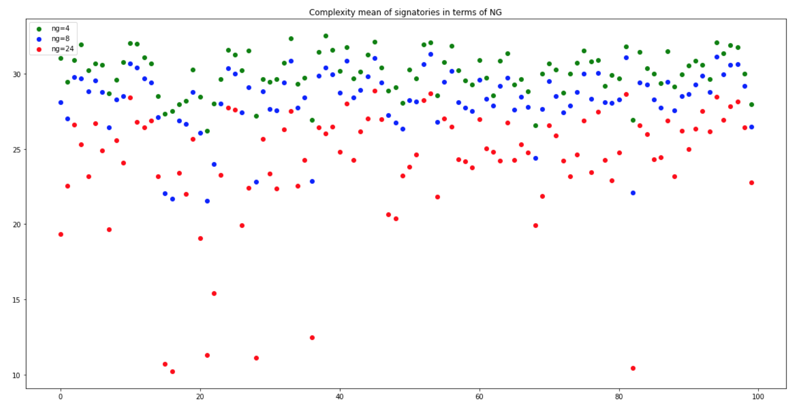
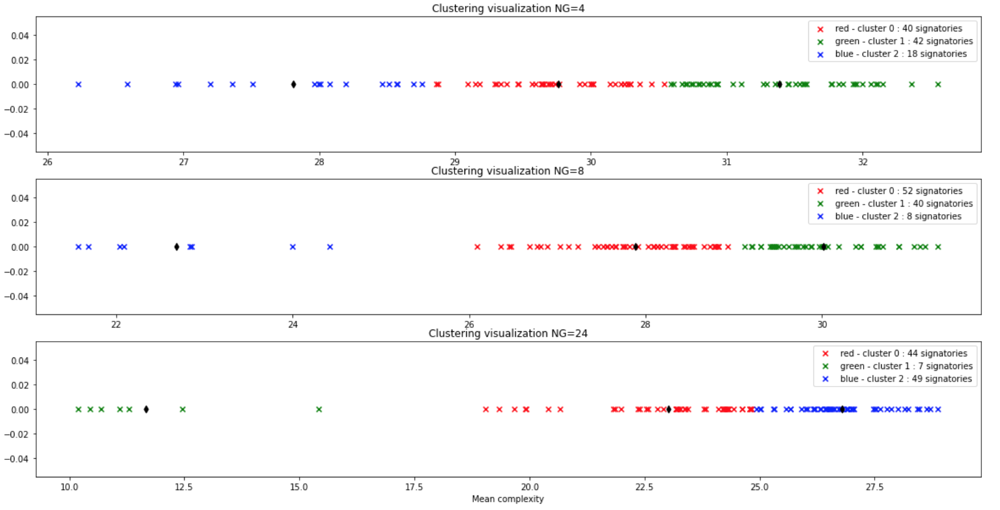
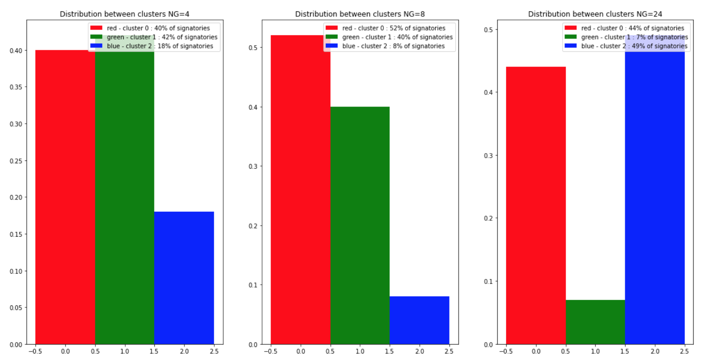

# Projet 2 - Classification non-supervisée de signature 

### Groupe n°12
Yasmine MAZOUZ  
Aymeric SCHNEIDER  
Nordine MARIE

## Tables des matières :

###1.    [Présentation des données](#data)
###2.		[Classification non-supervisées des personnes pour analyser l’apport de la mesure de complexité](#p3) 
###3.		[Classification non-supervisées des signatures (writer-independent)](#p2)
###4.		[Apprentissage et généralisation](#p3)

## 1. Présentation des données
### MCYT-100 :  
100 signataires - 25 signatures par signataire  

**Figure 1.a :** Les signatures du signataire n°17

### Complexités  :

Calculées par GMM avec un nombre de gaussiennes différent :  
NG = 4, 8 ou 24

**Figure 1.b :** Complexités moyennes des individus pour différentes valeurs de NG

## 2. Classification non-supervisées des personnes pour analyser l’apport de la mesure de complexité 

Pour chaque signataire nous calculons la complexité moyenne de ces signatures et ce pour les différentes valeures de NG. Nous obtenons ainsi pour chaque signataire 3 valeurs de complexités moyenne i.e pour NG = 2, 4, et 24. Nous représentons ces valeurs dans la figure çi-dessous :

**Figure 2.a :** Complexités moyennes des individus pour différentes valeurs de NG

###Nous pouvons faire deux observations :   
**Augmenter le nombre de gaussiennes NG :**    
1. Augmente la dispersion des complexités moyennes   
2. Diminue la moyenne des complexités moyennes 

En nous basant sur la complexité moyenne de chaque signataire nous allons classifier les signataires en 3 classes grâce aux méthodes de classification K-Moyennes et K-Means.

###1. K-Moyennes
**Pour NG=4**, on remarque que les 3 classes ne sont bien séparé, en effet la distance entre des individus "frontaliers" des différentes classes est très faible.

On en déduit donc que pour NG=4, il y'aurait très certainement des variabilités de classe d'une signature d'un même signataire si il a tendance a avoir une signature de complexité faible-moyen ou moyen-élévé.

On s'intéressera par ailleurs en 3. à la variabilité des signatures mais uniquement pour le cas NG = 24.

**Pour NG=8 et 24**, on observe déjà une meilleure classification notamment dans la séparation des signatures faibles et moyennements complexes.

Toutefois, on observe et on comprend ici le problème qui va nous suivre lors de tout ce projet, la classification des signatures à complexité moyennement haute. 

En effet, les signataires ayant une complexité de signature se situant sur la frontière moyen-haute vont très certainement générer de la variabilité et lorsqu'il faudra classifier les complexité de chaque signature et non pas la complexité moyenne de chaque signataire on observera très certainement une haute variabilité de classe chez les signataires à complexité moyen-élévé et une variabilité faible chez les signataires de complexité faible.

**Figure 2.1.a :** Visualisation de la classification pour différentes valeurs de NG

De plus, comme nous pouvons le voir ci-dessous, en augmentant NG on classifie d'autant moins de signataires en classe faible. Si on regarde la Figure 2.1.a on visualise cela par le passage de signataires de la classe faible à la classe moyen.

On se retrouve donc en NG=8 et 24 avec une forte distribution des signataires dans les classe à complexité moyennement et hautement élévée ce qui conforte notre remarque précédente.

**Figure 2.1.a :** Distribution des classes pour différentes valeurs de NG

Pour finir, avec la méthode de classification K-Means observons un échantillon de 5 signatures de chaque classes pour NG=24. La visualisation nous confirme ce que nous disait les données précedemment : si il est facile de distinguer la classe des signatures à complexité faible. Sans vérifier la complexité des signatures en légendes il nous est difficile de distinguer les classes moyenne et élévée.

**Figure 2.1.a :** Visualisation des signatures pour NG=24

###2. K-Medoids

**Figure 2.1.a :** Visualisation de la classification pour différentes valeurs de NG

**Figure 2.1.a :** Distribution des classes pour différentes valeurs de NG

**Figure 2.1.a :** Visualisation des signatures pour NG=24

## 3. Classification non-supervisées des signatures (writer-independent)  

## 4. Apprentissage et généralisation    

